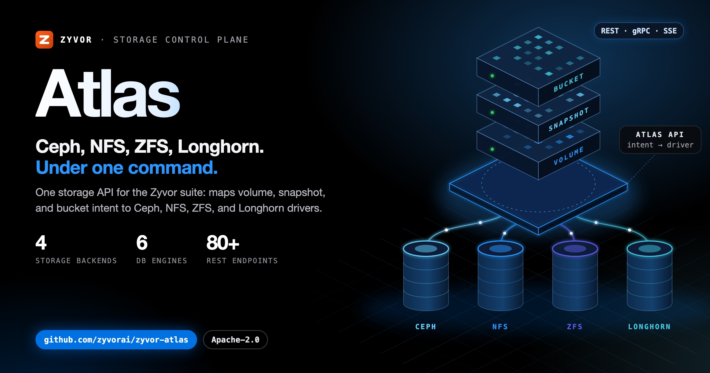
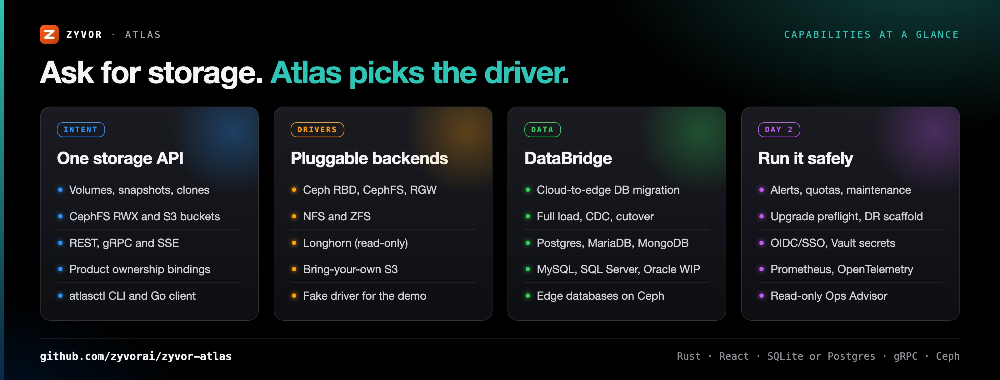
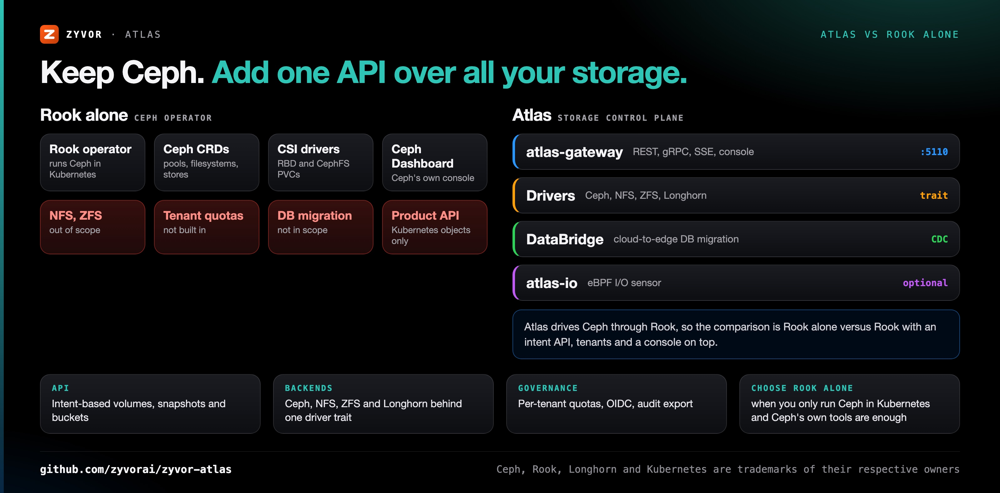
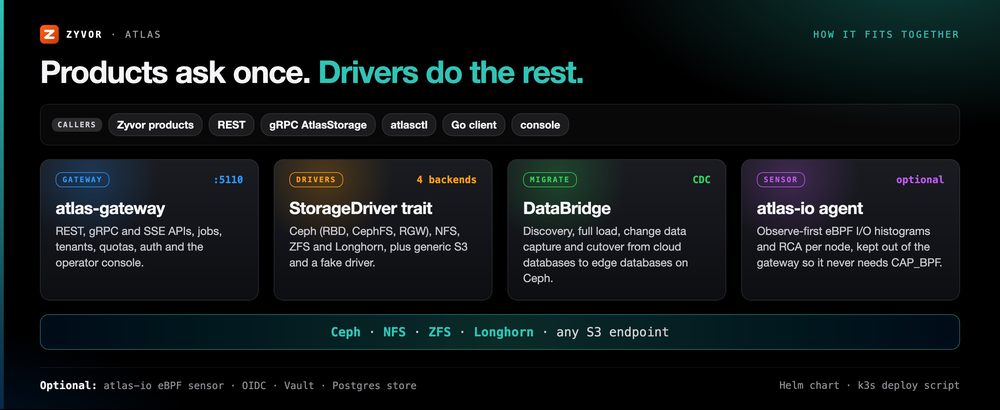
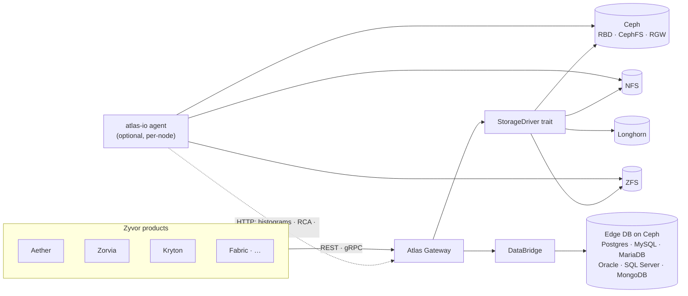

<!-- Copyright (c) 2026 ZyvorAI Labs Private Limited. -->
<!-- SPDX-License-Identifier: Apache-2.0 -->
<div align="center">

# Atlas

[](https://github.com/zyvorai/zyvor-atlas/actions/workflows/ci.yml)
[](LICENSE)
[](CHANGELOG.md)
[](Cargo.toml)
[](https://zyvorai.github.io/zyvor-atlas/)

[](https://zyvor.dev/schedule?utm_source=github&utm_medium=atlas&utm_campaign=readme_hero)
[](https://zyvor.dev/poc?utm_source=github&utm_medium=atlas&utm_campaign=readme_hero)
[](#quickstart)



### The world of storage, under one command.

**The central storage control plane for the Zyvor suite.** Products call stable Atlas APIs; Atlas maps intent to Ceph, NFS, ZFS and Longhorn through pluggable drivers. Object storage defaults to Ceph RGW; any S3-compatible endpoint is usable via the generic RGW client.

**4 storage backends** · **80+ REST endpoints** · **REST · gRPC · SSE** · **DataBridge DB migration** · **eBPF observe-first I/O sensor**

<sub>Rust · React · TypeScript · SQLite · gRPC · Ceph</sub>

</div>

**4** storage backends · **6** database engines in DataBridge ([status per engine](docs/STATUS.md)) · **80+** REST endpoints · **3** access surfaces (REST · gRPC · SSE) · **eBPF** observe-first I/O sensor

A gateway with an Apple Shop console for operators. Read the [full docs](https://zyvorai.github.io/zyvor-atlas/): quickstart, architecture, licensing.

---

## What's new

| | |
|---|---|
| **Apache License 2.0** | Relicensed from the Zyvor Production License: production, SaaS and managed-service use are permitted under the license's terms |
| **`atlas-io` eBPF I/O sensor** | Observe-first per-node agent: log2-µs histograms, cgroup/pid attribution, deterministic RCA, fail-open write-freeze leases; `atlasctl io …` ([docs](docs/IO_EBPF.md)) |
| **Go client** | Stdlib-only Go client for the REST API, with a contract test ([`clients/go`](clients/go)) |
| **DataBridge fixes** | MySQL `TIMESTAMP` columns through CDC, MySQL 8 auth, a capped Kafka Connect worker |
| **Atlas Native (experimental)** | An append-only replicated extent engine with Raft, mutual TLS, a node API, Helm chart and a FUSE client — Phase 1, see [docs/NATIVE_STORAGE.md](docs/NATIVE_STORAGE.md) |

Details: [CHANGELOG.md](CHANGELOG.md).

---

## Why Atlas

| When this happens… | Atlas gives you… |
|---|---|
| Every product talks to Ceph pools, NFS exports and ZFS datasets its own way | One intent API (volumes, snapshots, clones, CephFS RWX, S3 buckets) over REST and gRPC |
| Adding a backend means touching every product | A `StorageDriver` trait with Ceph, NFS, ZFS and Longhorn drivers, plus generic S3 |
| Tenants share storage with no guardrails | Per-tenant quotas, DB-backed rate limiting, OIDC/SSO, Vault-backed secrets and token revocation |
| Databases need to move from the cloud to the edge | DataBridge: discovery, full load, CDC and cutover onto edge databases on Ceph |
| Nobody can say which workload is hammering a disk | The optional `atlas-io` eBPF sensor, kept out of the gateway so it never needs `CAP_BPF` |
| You want to try it without a storage cluster | `make run` starts the gateway against a fake driver so you can click through the whole console |



### Capabilities

<table>
<tr>
<td valign="top" width="33%">
<b>Intent to storage</b><br>
Volumes, snapshots, clones, CephFS RWX and S3 buckets via REST + gRPC. Ceph RGW is the default object backend.
</td>
<td valign="top" width="33%">
<b>Pluggable drivers</b><br>
Real Ceph first; NFS, ZFS and Longhorn; a fake driver for the local demo. Generic S3 via <code>atlas-driver-rgw</code>.
</td>
<td valign="top" width="33%">
<b>DataBridge</b><br>
Cloud-to-edge DB migration (six engines, CDC, cutover) on Ceph.
</td>
</tr>
<tr>
<td valign="top" width="33%">
<b>Day-2</b><br>
Alerts, maintenance, governance, quotas, upgrade preflight, DR scaffolding.
</td>
<td valign="top" width="33%">
<b>Ops Advisor</b><br>
Explainable AI-assisted risk scoring and prioritized, read-only runbooks.
</td>
<td valign="top" width="33%">
<b>Console</b><br>
Apple.com-style top-nav shell, SF type, Night/Day themes.
</td>
</tr>
<tr>
<td valign="top" width="33%">
<b>atlas-io (eBPF sensor)</b><br>
Optional, observe-first I/O agent: device-attributed histograms, workload/RCA, fail-open leases — kept out of the gateway so it never needs <code>CAP_BPF</code>.
</td>
<td valign="top" width="33%">
<b>Observability</b><br>
Prometheus <code>/metrics</code>, forecast/history, OpenTelemetry tracing, unified <code>/events</code>, deep readyz/livez.
</td>
<td valign="top" width="33%">
<b>Governance & security</b><br>
Per-tenant quotas, DB-backed rate limiting, OIDC/SSO, Vault-backed secrets, token revocation.
</td>
</tr>
</table>

Customer-facing feature guide: [docs/atlas-customer-feature-guide.md](docs/atlas-customer-feature-guide.md).

---

## Atlas vs Rook alone



| | **Atlas** | **Rook alone** |
|---|---|---|
| What it is | Storage control plane with drivers per backend | Kubernetes operator that runs Ceph |
| Interface for products | Intent-based REST, gRPC and SSE APIs | Kubernetes custom resources and CSI PVCs |
| Backends | Ceph (RBD, CephFS, RGW), NFS, ZFS, Longhorn, generic S3 | Ceph |
| Tenancy | Per-tenant quotas, rate limiting, OIDC/SSO, audit export | Kubernetes RBAC and namespaces |
| Console | Built-in operator console | Ceph Dashboard |
| Database migration | DataBridge (discovery, full load, CDC, cutover) | Not in scope |
| Kubernetes-native provisioning | Yes, via drivers | Yes |
| **Choose Rook alone when** | | You only run Ceph inside Kubernetes and Ceph's own dashboard and CRDs are enough |

The longer comparison from earlier releases:

| | Atlas | Raw Ceph tooling | Rook alone |
|---|---|---|---|
| Intent-based API (not pool internals) | Yes | No | No |
| One API across Ceph + NFS + ZFS | Yes | Ceph only | Ceph only |
| Cloud-to-edge DB migration (DataBridge) | Yes | No | No |
| Per-tenant quotas & governance | Yes | Partial | No |
| Built-in operator console | Yes | Ceph Dashboard only | No |
| Kubernetes-native provisioning | Yes (via drivers) | No | Yes |
| eBPF I/O observability, kept out of the control plane | Yes (`atlas-io`) | No | No |

---

## See it live

<div align="center">

<picture>
  <source media="(prefers-color-scheme: dark)" srcset="docs/ux/night-00-overview.png">
  
</picture>

<sub>Storage Center overview (follows your light/dark setting)</sub>

</div>

Live console shots (captured against a lab deployment), Day theme shown:

<table>
<tr>
<td width="33%"><br><sub>Volumes</sub></td>
<td width="33%"><br><sub>Observatory</sub></td>
<td width="33%"><br><sub>Ceph</sub></td>
</tr>
<tr>
<td width="33%"><br><sub>DataBridge</sub></td>
<td width="33%"><br><sub>Alerts</sub></td>
<td width="33%"><br><sub>Jobs</sub></td>
</tr>
</table>

Full tour: [Gallery](https://zyvorai.github.io/zyvor-atlas/gallery).

---

## How it fits together





Full write-up: [docs/ARCHITECTURE.md](docs/ARCHITECTURE.md). Product integration over gRPC and the owner convention: [docs/PRODUCTS.md](docs/PRODUCTS.md).

---

## Quickstart

Requirements: a Rust toolchain and `make` for the local run; a k3s host for the remote deploy.

```bash
make run
# Console → http://127.0.0.1:5110
cargo run -p atlasctl -- --base-url http://127.0.0.1:5110 health
```

No Ceph cluster needed to try it — `make run` starts the gateway against a fake driver so
you can click through the whole console immediately.

Deploy to a remote k3s host:

```bash
./scripts/deploy-remote.sh <host> <user>
# UI → http://<host>:30510
```

| Track | Where |
| --- | --- |
| **Source, issues, releases** (Apache License 2.0) | This repo |
| **Project / contact** | [https://zyvor.dev](https://zyvor.dev) |
| **Docs site** | https://zyvorai.github.io/zyvor-atlas/ |

More: [docs/GETTING_STARTED.md](docs/GETTING_STARTED.md) · [docs/DEPLOYMENT.md](docs/DEPLOYMENT.md) · [docs/ARCHITECTURE.md](docs/ARCHITECTURE.md).

---

## Documentation

| For | Start at |
|---|---|
| Engineers evaluating or building on Atlas | **[docs/README.md](docs/README.md)** — architecture, API reference, drivers, day-2 ops, DataBridge, AI Advisor, the `atlas-io` eBPF sensor |
| Operators running the console day to day | **[docs/customer/README.md](docs/customer/README.md)** — getting started, admin basics, per-page reference |
| A single narrative read of everything the product does | **[docs/atlas-customer-feature-guide.md](docs/atlas-customer-feature-guide.md)** |
| Published docs site | [zyvorai.github.io/zyvor-atlas](https://zyvorai.github.io/zyvor-atlas/) |

---

## Maturity

Atlas is Apache-2.0 software: use, modify and redistribute it, including in production and in commercial
products, under the terms of the license ([full guide](docs/LICENSING.md)). Boundaries that are about
maturity, not licensing, live in [docs/STATUS.md](docs/STATUS.md): what is verified on real infrastructure,
and what is lab-verified only.

> From [docs/STATUS.md](docs/STATUS.md) for 0.4.0: *Lab verification is not production support. Nothing
> below is bank or enterprise GA.* The Ceph / Rook control plane and Ceph RGW are verified on a single-node
> Rook lab; DataBridge Postgres, MariaDB and MongoDB are verified through cutover; MySQL CDC is live for
> `DATETIME` only; SQL Server and Oracle are discovery-only; cross-cluster DR and the live eBPF attach are
> experimental.

---

## Part of the Zyvor stack

| Product | Role next to Atlas |
|---|---|
| **Atlas** | Storage control plane: one API over Ceph, NFS, ZFS and Longhorn |
| **[Aether](https://github.com/zyvorai/Aether)** | Runtime portability plane; a workload with `storage_class: atlas/<policy>` provisions its volume through Atlas |
| **[Zorvia](https://github.com/zyvorai/zyvor-zorvia)** | KubeVirt VM platform; `zorvia` is a product owner id in Atlas's gRPC `Owner` convention |
| **[Kryton](https://github.com/zyvorai/zyvor-kryton)** | `kryton` is a product owner id in the same convention |
| **[Transiva](https://github.com/zyvorai/zyvor-transiva)** | VM migration; recorded as owner id `hyper2kvm`, Transiva import is on the roadmap |

→ [zyvor.dev](https://zyvor.dev)

---

## Contributing

Read [CONTRIBUTING.md](CONTRIBUTING.md) for conventions and how to add an endpoint, driver, or
migration. Contributions are made under the [CLA](CLA.md), signed off per the
[DCO](DCO.md) (`git commit -s`), and governed by our [Code of Conduct](CODE_OF_CONDUCT.md).
Found a security issue? See [SECURITY.md](SECURITY.md) rather than opening a public issue.

## License

Atlas is **free and open source** under the **[Apache License, Version 2.0](LICENSE)**. See [docs/LICENSING.md](docs/LICENSING.md)
and [NOTICE](NOTICE). That does not change.

**Zyvor Enterprise** adds what production teams ask for: supported releases, deployment and upgrade guidance, priority incident triage, a named technical contact and 24x7 critical intake. Plans and terms: [docs/SUBSCRIPTION-MODEL.md](docs/SUBSCRIPTION-MODEL.md) · [Pricing](https://zyvor.dev/pricing?utm_source=github&utm_medium=atlas&utm_campaign=readme_license) · [sales@zyvor.dev](mailto:sales@zyvor.dev).

<div align="center">

<sub>Star history</sub>

[](https://star-history.com/#zyvorai/atlas&Date)

</div>

---

<div align="center">

### Put every storage backend behind one API

[](https://zyvor.dev/schedule?utm_source=github&utm_medium=atlas&utm_campaign=readme_footer)
[](https://zyvor.dev/poc?utm_source=github&utm_medium=atlas&utm_campaign=readme_footer)
[](https://zyvor.dev/pricing?utm_source=github&utm_medium=atlas&utm_campaign=readme_footer)
[](mailto:sales@zyvor.dev?subject=Atlas)
[](https://github.com/zyvorai/zyvor-atlas)

</div>
