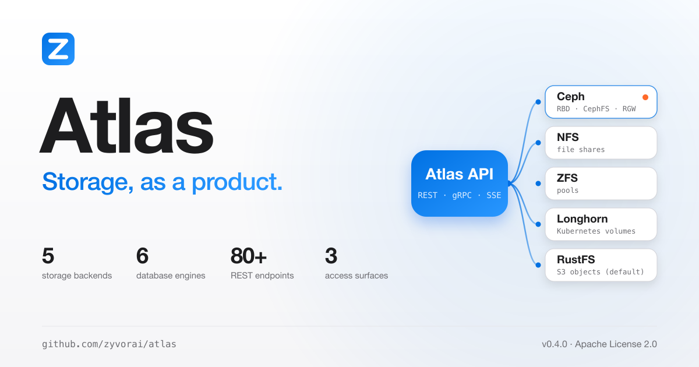
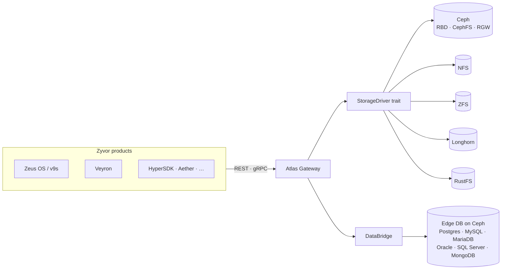

<!-- Copyright (c) 2026 ZyvorAI Labs Private Limited. -->
<!-- SPDX-License-Identifier: LicenseRef-Zyvor-Production-1.0 -->
<div align="center">

<picture>
  <source media="(prefers-color-scheme: dark)" srcset="docs/social/atlas-share-card-dark.png">
  
</picture>

# Atlas

### Storage, as a product.

The **central storage control plane** for the Zyvor suite.<br>
Products call stable Atlas APIs; Atlas maps intent to Ceph, NFS, ZFS, Longhorn and RustFS through pluggable drivers.

[](https://github.com/zyvorai/atlas/actions/workflows/ci.yml)
[](LICENSE)
[](CHANGELOG.md)
[](https://zyvorai.github.io/atlas/)

[**Quickstart**](#quickstart) · [**Docs**](https://zyvorai.github.io/atlas/) · [**Gallery**](#dashboard-gallery) · [**Architecture**](#architecture-at-a-glance) · [**License**](#license)

<sub>Rust · React · TypeScript · SQLite · gRPC · Ceph</sub>

</div>

---

**5** storage backends · **6** database engines migratable via DataBridge · **80+** REST endpoints · **3** access surfaces (REST · gRPC · SSE)

A gateway with an Apple Shop console for operators. Read the [full docs](https://zyvorai.github.io/atlas/): quickstart, architecture, licensing.

<div align="center">

<picture>
  <source media="(prefers-color-scheme: dark)" srcset="docs/ux/night-00-overview.png">
  
</picture>

</div>

## Quickstart

```bash
make run
# Console → http://127.0.0.1:5110
cargo run -p atlasctl -- --base-url http://127.0.0.1:5110 health
```

No Ceph cluster needed to try it — `make run` starts the gateway against a fake driver so
you can click through the whole console immediately.

Deploy to a remote k3s host:

```bash
./scripts/deploy-remote.sh <host> <user>
# UI → http://<host>:30510
```

| Track | Where |
| --- | --- |
| **Non-production use** (free under the Zyvor Production License) | This repo |
| **Production / commercial license** | [https://zyvor.dev](https://zyvor.dev) |
| **Docs site** | https://zyvorai.github.io/atlas/ |

More: [docs/GETTING_STARTED.md](docs/GETTING_STARTED.md) · [docs/DEPLOYMENT.md](docs/DEPLOYMENT.md) · [docs/ARCHITECTURE.md](docs/ARCHITECTURE.md).

## Capabilities

<table>
<tr>
<td valign="top" width="33%">
<b>Intent to storage</b><br>
Volumes, snapshots, clones, CephFS RWX and S3 buckets via REST + gRPC. RustFS is the default object backend; Ceph RGW is explicitly selectable via <code>backend_id</code>.
</td>
<td valign="top" width="33%">
<b>Pluggable drivers</b><br>
Real Ceph first; NFS, ZFS, Longhorn and RustFS; a fake driver for the local demo.
</td>
<td valign="top" width="33%">
<b>DataBridge</b><br>
Cloud-to-edge DB migration (six engines, CDC, cutover) on Ceph.
</td>
</tr>
<tr>
<td valign="top" width="33%">
<b>Day-2</b><br>
Alerts, maintenance, governance, quotas, upgrade preflight, DR scaffolding.
</td>
<td valign="top" width="33%">
<b>Ops Advisor</b><br>
Explainable AI-assisted risk scoring and prioritized, read-only runbooks.
</td>
<td valign="top" width="33%">
<b>Console</b><br>
Apple.com-style top-nav shell, SF type, Night/Day themes.
</td>
</tr>
</table>

Customer-facing feature guide: [docs/atlas-customer-feature-guide.md](docs/atlas-customer-feature-guide.md).

## Dashboard gallery

Live console shots (captured against a lab deployment), Day theme shown; the overview above follows your light/dark setting.

<table>
<tr>
<td width="33%"><br><sub>Volumes</sub></td>
<td width="33%"><br><sub>Observatory</sub></td>
<td width="33%"><br><sub>Ceph</sub></td>
</tr>
<tr>
<td width="33%"><br><sub>DataBridge</sub></td>
<td width="33%"><br><sub>Alerts</sub></td>
<td width="33%"><br><sub>Jobs</sub></td>
</tr>
</table>

Full tour: [Gallery](https://zyvorai.github.io/atlas/gallery).

## Architecture at a glance



Full write-up: [docs/ARCHITECTURE.md](docs/ARCHITECTURE.md).

## Why Atlas

| | Atlas | Raw Ceph tooling | Rook alone |
|---|---|---|---|
| Intent-based API (not pool internals) | Yes | No | No |
| One API across Ceph + NFS + ZFS | Yes | Ceph only | Ceph only |
| Cloud-to-edge DB migration (DataBridge) | Yes | No | No |
| Per-tenant quotas & governance | Yes | Partial | No |
| Built-in operator console | Yes | Ceph Dashboard only | No |
| Kubernetes-native provisioning | Yes (via drivers) | No | Yes |

## Important boundaries

What's free under the Zyvor Production License vs. what needs a commercial license
([full guide](docs/LICENSING.md)):

| Use case | Allowed without a paid license? |
| --- | --- |
| Development, testing, evaluation, research, education | Yes |
| Non-production laboratory and proof-of-concept use | Yes |
| Production environments and customer workloads | No — needs a commercial license |
| SaaS, managed services, OEM, appliances | No — needs a commercial license |
| Redistribution or resale | No — needs written permission and a commercial license |

## License

Licensed under the **[Zyvor Production License v1.0](LICENSE)**.

- **Free** for development, testing, evaluation, research, education, and non-production labs
- **Paid commercial license required** for production, customer workloads, SaaS, managed services, OEM, redistribution, and other revenue-generating use

Commercial terms are issued separately: [https://zyvor.dev](https://zyvor.dev). See [docs/LICENSING.md](docs/LICENSING.md). Contributions: [CLA.md](CLA.md) + [DCO.md](DCO.md) (`git commit -s`),
governed by our [Code of Conduct](CODE_OF_CONDUCT.md).

<div align="center">

<sub>Star history</sub>

[](https://star-history.com/#zyvorai/atlas&Date)

</div>
